# DVLD - Driving & Vehicle License Department System

A full desktop management system developed using C# WinForms and SQL Server.

The system simulates a real Driving and Vehicle License Department (DVLD) and helps manage driving license services, applications, tests, drivers, and users.

---

# 📌 Project Overview

This project was built as part of the Programming Advices roadmap to practice:

- Object-Oriented Programming (OOP)
- 3-Tier Architecture
- Database Design
- ADO.NET
- Windows Forms Development
- Business Logic Implementation

The application provides a complete workflow for managing driving license operations.

---

# 🚀 Features
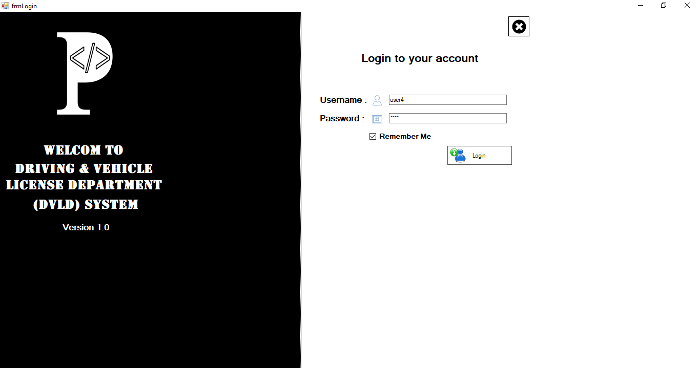
.
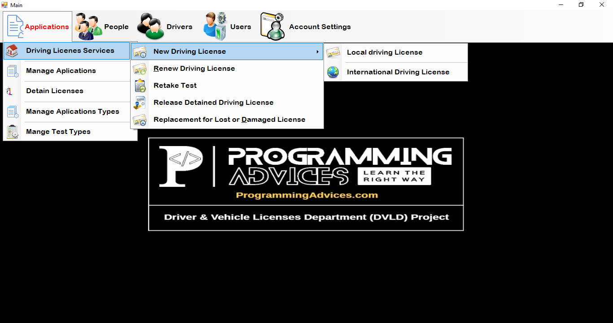
.
## 👤 People Management

- Add new people
- Update person information
- Delete people
- Search and filter people
- Store personal details and images
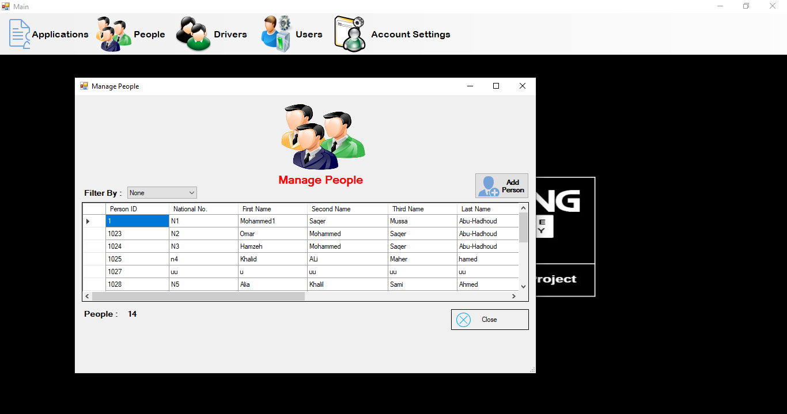
---

## 🚘 Driver Management
- Create drivers linked to people
- View driver history
- Manage driver records
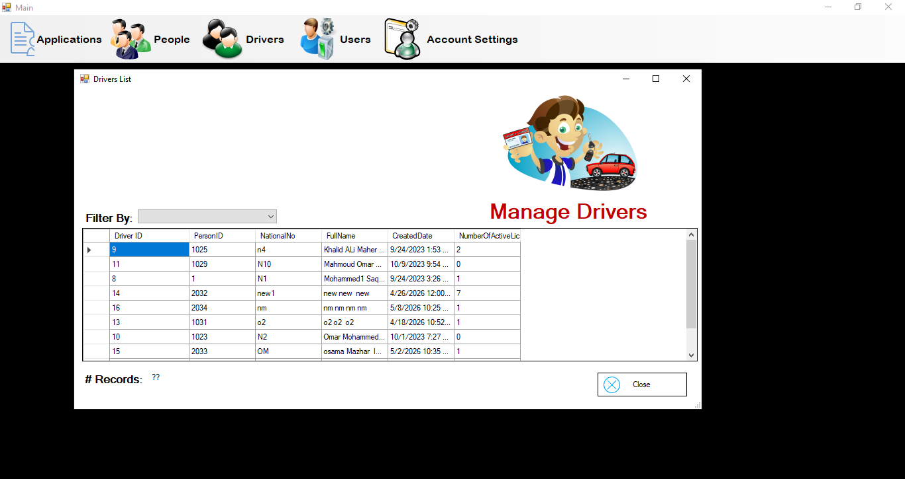
---

## 📄 License Services
- Issue new local driving licenses
  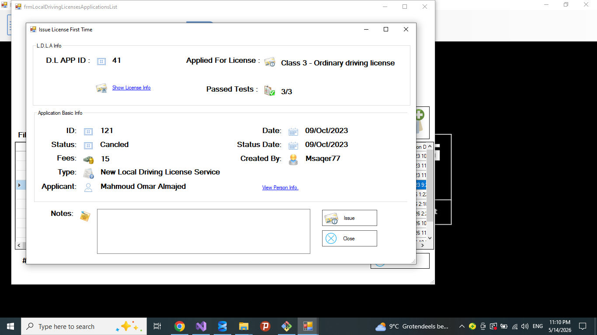
- Renew licenses
 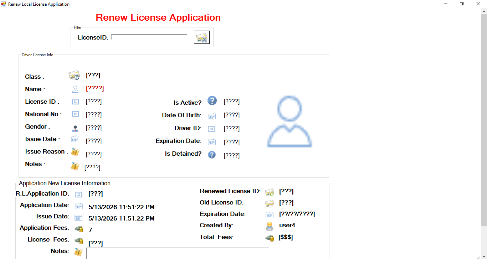
- Replace lost licenses &  Replace damaged licenses
 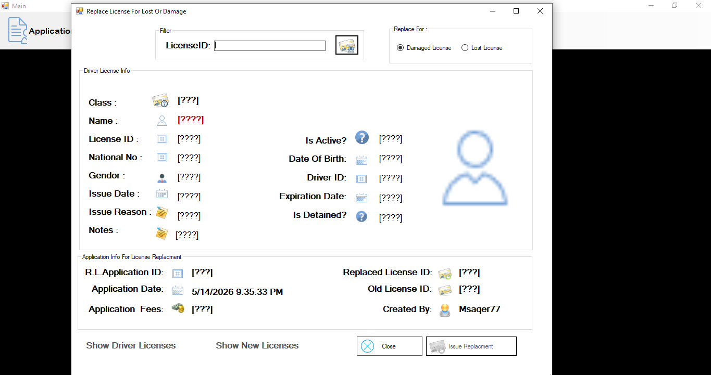
- Release detained licenses
 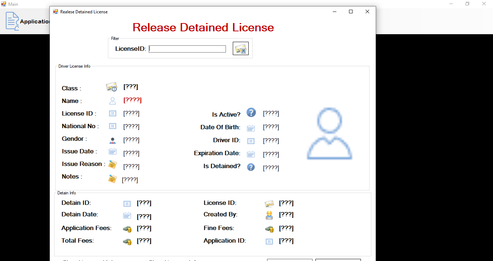
- Retake tests
 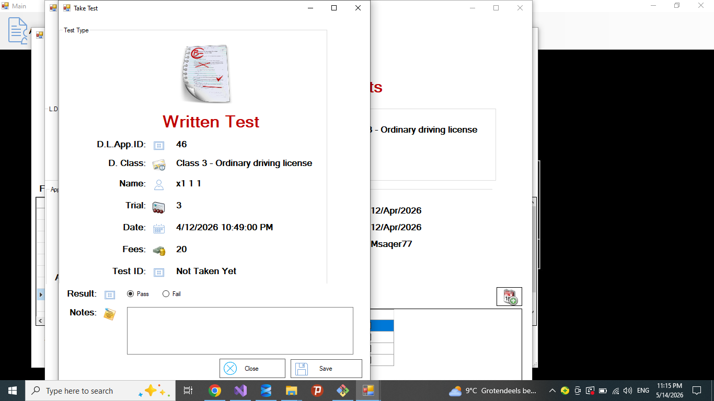
- Issue new International driving licenses
   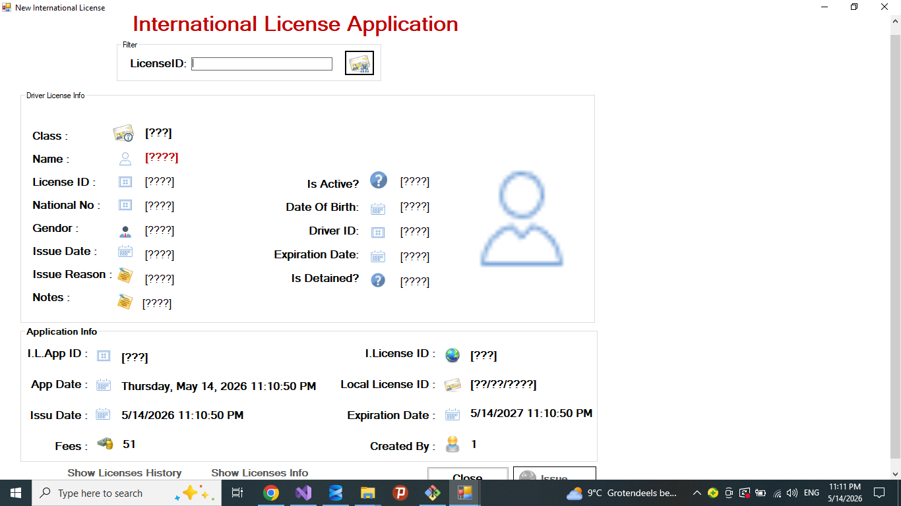
---


## 🧪 Test Management
- Schedule vision tests
- Schedule written tests
- Schedule street tests
- Manage test appointments
- Save test results
 
take_Test
---

## 📋 Application Management
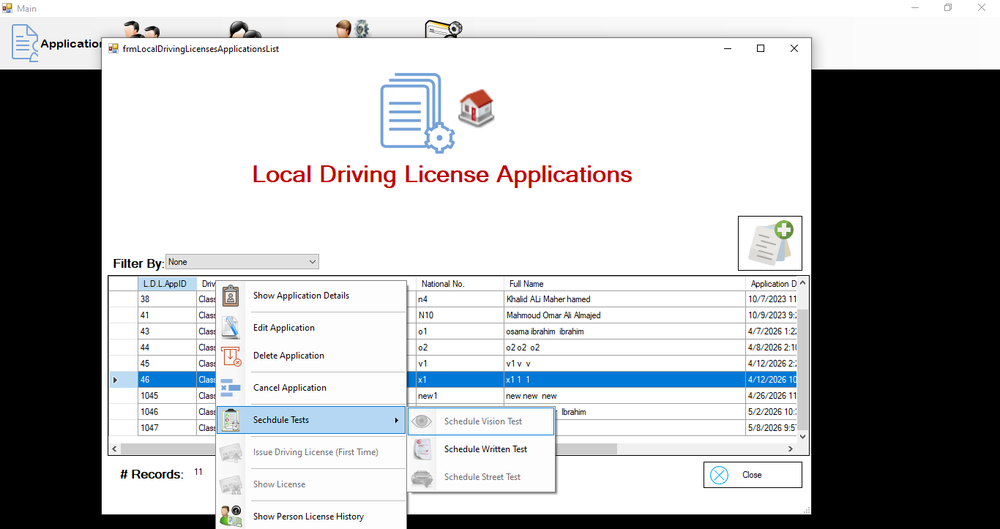
- Create license applications
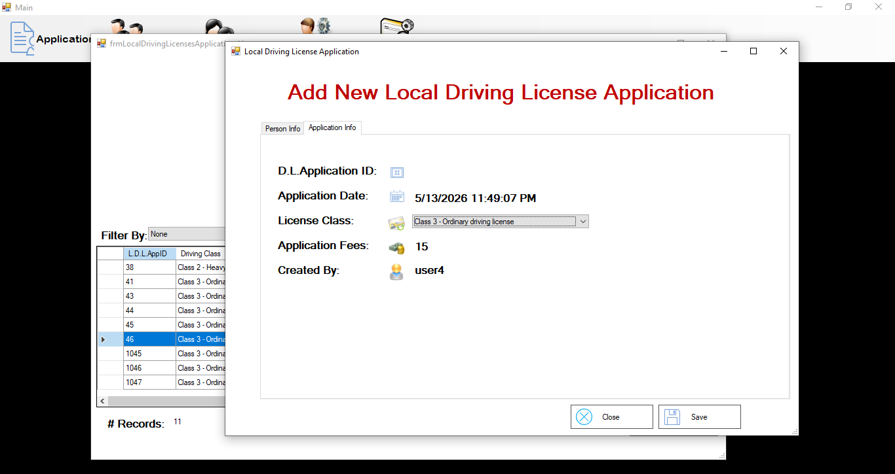
- Track application status
- Cancel applications
- Complete applications

---

## 🔐 User Management
- Add system users
   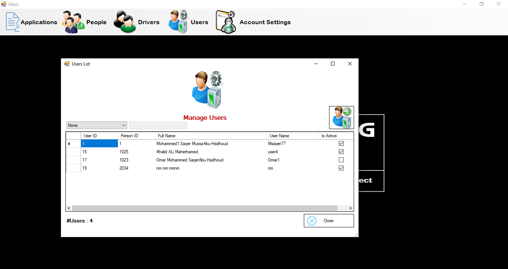
- Manage permissions
- Enable/Disable users
   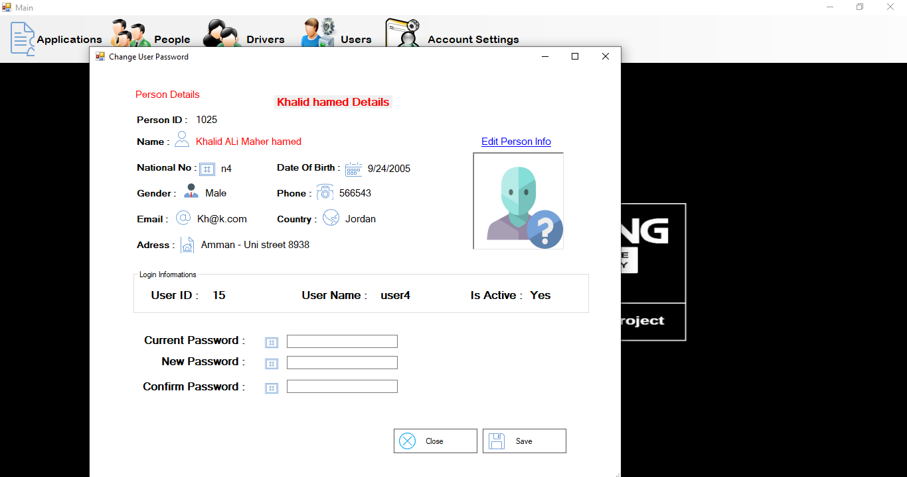
- Login system

---

## 💰 Fees & Validation
- Apply service fees
- Prevent duplicate active licenses
- Validate business rules
- Age validation
- License status checking

---

# 🏗 Architecture

The project follows the 3-Tier Architecture:

Presentation Layer (WinForms UI)
        ↓
Business Logic Layer (BLL)
        ↓
Data Access Layer (DAL)
        ↓
SQL Server Database
```
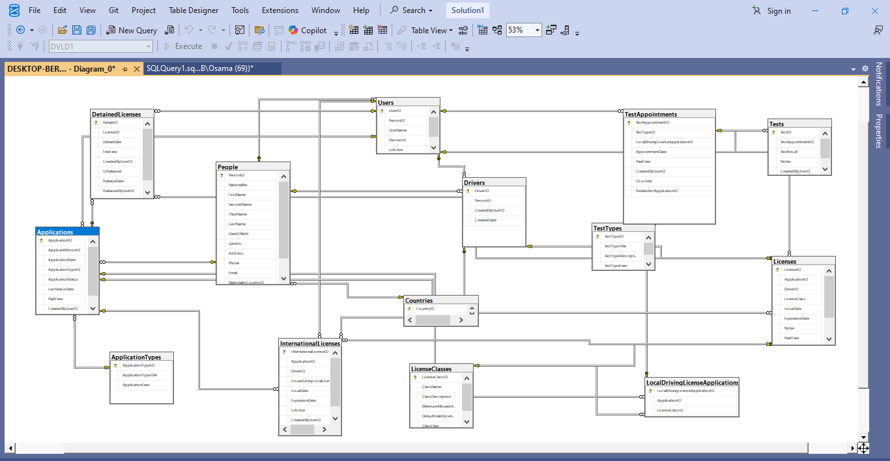

---

# 🛠 Technologies Used

- C#
- .NET Framework
- WinForms
- SQL Server
- ADO.NET
- Git & GitHub

---

# 🗄 Database
 
The project uses SQL Server database with relational tables and stored procedures to manage:

- Applications
- Drivers
- Licenses
- Tests
- Users
- Appointments
- Detained Licenses

---

# ▶️ How To Run

1. Clone the repository
2. Restore the SQL Server database
3. Open the solution using Visual Studio
4. Update the connection string
5. Run the project

---

# 👨‍💻 Author

Osama Ibrahim


------------------------------------------------------------------------------------------------------------------------------------------

------------------------------------------------------------------------------------------------------------------------------------------

# 🚦 نظام إدارة دائرة المركبات ورخص القيادة (DVLD)

نظام مكتبي متكامل تم تطويره باستخدام C# WinForms و SQL Server.

يحاكي النظام دائرة حقيقية لإدارة المركبات ورخص القيادة، ويساعد في إدارة طلبات الرخص، الاختبارات، السائقين، والمستخدمين.

---

# 📌 نظرة عامة على المشروع

تم بناء هذا المشروع كجزء من خارطة التعلم الخاصة بمنصة Programming Advices بهدف التطبيق العملي على:

- البرمجة كائنية التوجه (OOP)
- معمارية الطبقات الثلاث (3-Tier Architecture)
- تصميم قواعد البيانات
- ADO.NET
- تطوير تطبيقات Windows Forms
- تطبيق منطق الأعمال (Business Logic)

يوفر التطبيق دورة عمل متكاملة لإدارة عمليات إصدار وتجديد رخص القيادة.

---

# 🚀 المميزات

## 👤 إدارة الأشخاص
- إضافة أشخاص جدد
- تعديل بيانات الأشخاص
- حذف الأشخاص
- البحث والتصفية
- حفظ الصور والبيانات الشخصية

---

## 🚘 إدارة السائقين
- إنشاء سائقين مرتبطين بالأشخاص
- عرض سجل السائق
- إدارة بيانات السائقين

---

## 📄 خدمات الرخص
- إصدار رخص قيادة محلية جديدة
- تجديد الرخص
- إصدار بدل فاقد
- إصدار بدل تالف
- فك حجز الرخص
- إعادة الاختبارات
- إصدار رخص قيادة دولية

---

## 🧪 إدارة الاختبارات
- جدولة اختبار النظر
- جدولة الاختبار النظري
- جدولة اختبار القيادة العملي
- إدارة مواعيد الاختبارات
- حفظ نتائج الاختبارات

---

## 📋 إدارة الطلبات
- إنشاء طلبات الرخص
- تتبع حالة الطلبات
- إلغاء الطلبات
- إكمال الطلبات

---

## 🔐 إدارة المستخدمين
- إضافة مستخدمين للنظام
- إدارة الصلاحيات
- تفعيل وتعطيل المستخدمين
- نظام تسجيل الدخول

---

## 💰 الرسوم والتحقق
- تطبيق رسوم الخدمات
- منع وجود رخص نشطة مكررة
- التحقق من قوانين العمل
- التحقق من العمر
- التحقق من حالة الرخصة

---

# 🏗 معمارية المشروع

يعتمد المشروع على معمارية الطبقات الثلاث (3-Tier Architecture):


واجهة المستخدم  (WinForms UI)
                                                                                                   ↓
        
طبقة منطق الأعمال (BLL)
                                                                                                   ↓
طبقة الوصول للبيانات (DAL)
                                                                                                   ↓
قاعدة بيانات SQL Server
```

---

# 🛠 التقنيات المستخدمة

- C#
- .NET Framework
- WinForms
- SQL Server
- ADO.NET
- Git & GitHub

---

# 🗄 قاعدة البيانات

يستخدم المشروع قاعدة بيانات SQL Server تحتوي على جداول مترابطة وإجراءات مخزنة لإدارة:

- الطلبات

- السائقين
- الرخص
- الاختبارات
- المستخدمين
- المواعيد
- الرخص المحجوزة

---

# ▶️ طريقة التشغيل

1. استنساخ المشروع (Clone Repository)
2. استعادة قاعدة البيانات باستخدام ملف SQL
3. فتح المشروع باستخدام Visual Studio
4. تعديل Connection String
5. تشغيل المشروع

---
# 👨‍💻 المطور

Osama Ibrahim
